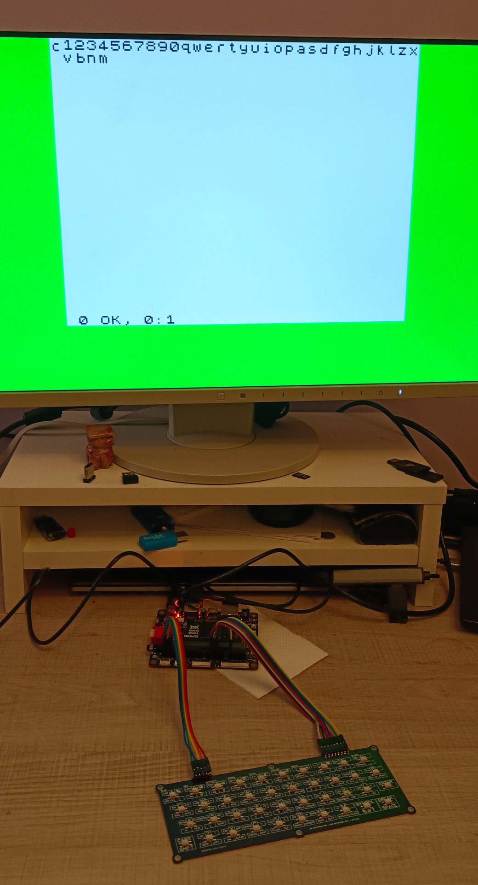

**ZX Spectrum Emulator FPGA Sipeed Tang Primer 20k**

This repo contains ZX Spectrum emulator on FPGA. I have used Sipeed Tang Primer 20k fpga board.
Currently video (HDMI otuput) and keyborad is working (keyboard attached trhough PMOD pins).

I have used ZX Spectrum 48k Mini keyboard V2.3 (PCB board with microswitches). I believe normal ZX Spectrum keybard can be used.

I`m not VHDL/FPGA specialist. I'm learner. I have learned a lot while doing this project.

I have used following IP Cores taken from Gowin EDA - [https://www.gowinsemi.com/en/support/download_eda/](https://www.gowinsemi.com/en/support/download_eda/) :

- DVI TX for HDMI output
- Gowin PLL - for getting frequency for HDMI
- Gowin DPB - RAM memory
- Second GOWIN DPB for video memory attributes - memory are which contains color and flash information.
- GOWIN PROM - ROM memory - already added ZX Spectrum ROM (according to Amstrad, it is freely distributable). [ZX Spectrum ROM Licensing](rom_license.md)

External sources:

- T80 - Z80 CPU core is taken from [https://github.com/mist-devel/T80](https://github.com/mist-devel/T80)

My plan is to add:

- sound output
- possibility to load some files

**Place and Route stats**
Logic	3074/20736	15%

- LUT,ALU,ROM16	2978(2752 LUT, 226 ALU, 0 ROM16)
- SSRAM(RAM16)	16

Register	739/16173	5%

- Logic Register as FF	738/15552	5%
- I/O Register as FF	1/621	<1%

CLS	1905/10368	19%

I/O Port	27	-

I/O Buf	22

- Input Buf	8
- Output Buf 14

IOLOGIC	4 OSER10 4%  
BSRAM	25 DPB 9 pROM 74%  
PLL	2/4	50%

Comment: memory block is heavily used. I wanted to have simplified design. For sake of simplicity, I have postponed usage of DDR memory on board. Maybe in later timer I`ll add DDR. Anyway, there is a lot of logic space for new features.
